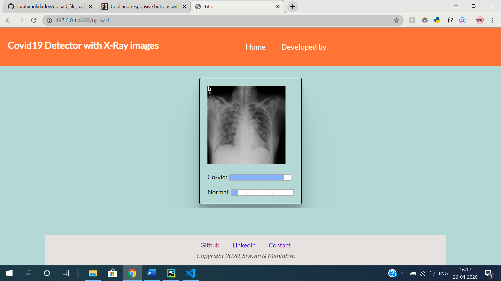
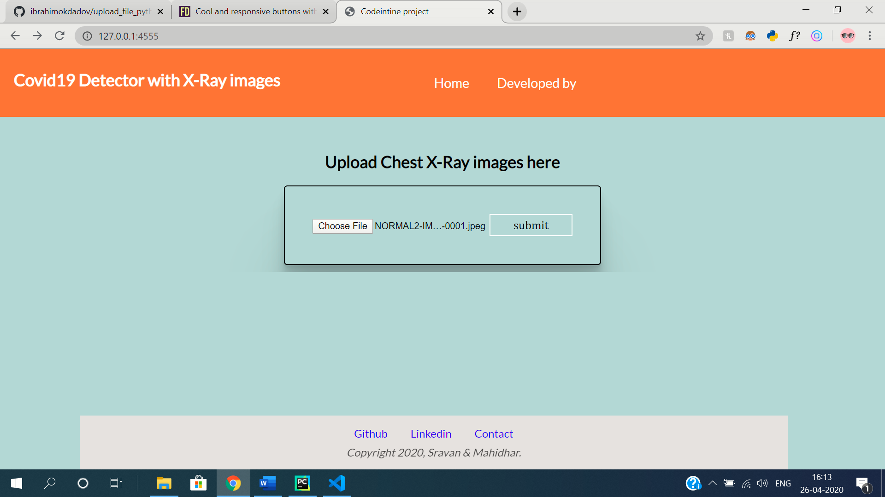
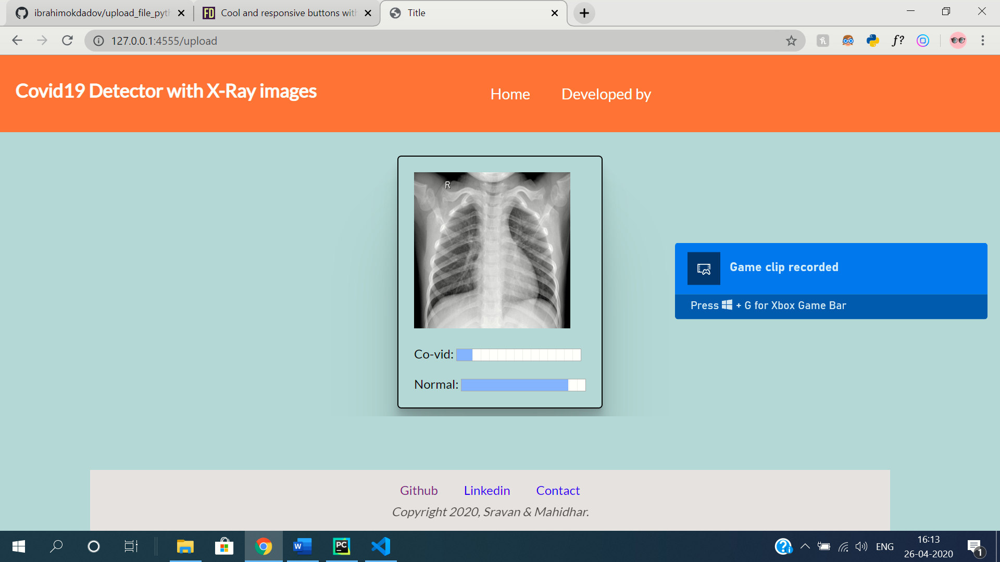

# codeintine
Our prototype detects the covid19 chances with xray images
you can see sample preview below:
 

 

to run - run app.py and open "http://127.0.0.1:4555/" this link in your browser and update some sample images of xrays from given dataset or own. You can see its output
